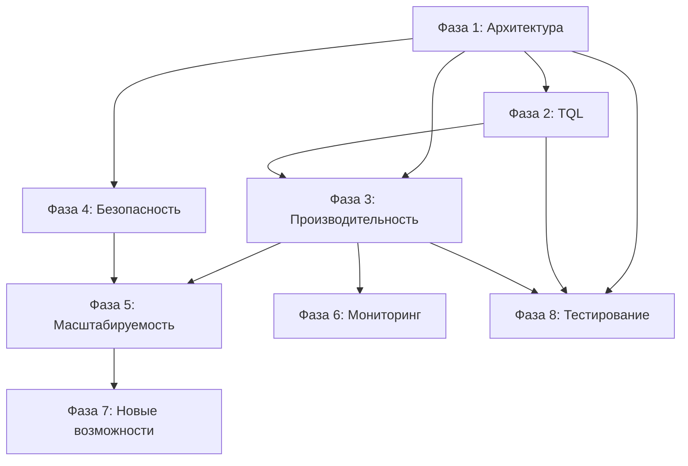

# План развития ToroidalDB

## Обзор

Данный план описывает систематическое развитие проекта ToroidalDB с акцентом на топологические и векторные возможности, которые отличают его от традиционных баз данных.

---

## Фаза 1: Архитектурные улучшения (Foundation)

### 1.1 Модульность и структура кода

#### 1.1.1 Рефакторинг main.rs
**Приоритет:** P0 (Критический)
**Зависимости:** Нет
**Описание:** Разделить монолитный `main.rs` на специфичные модули

```rust
// src/http/routes/           # HTTP-маршруты
// src/http/handlers.rs        # Обработчики запросов
// src/core/                   # Бизнес-логика
// src/services/              # Сервисный слой
```

**Задачи:**
- [ ] Создать `src/http/routes/mod.rs` для маршрутов
- [ ] Создать `src/http/handlers/` для обработчиков
- [ ] Создать `src/core/` для бизнес-логики
- [ ] Перенести логику из `main.rs` в соответствующие модули
- [ ] Обновить `main.rs` для координации модулей

#### 1.1.2 Улучшение архитектуры TQL
**Приоритет:** P0 (Критический)
**Зависимости:** 1.1.1
**Описание:** Создать отдельные модули для парсера, оптимизатора и исполнителя

```rust
// src/tql/parser/           # Парсер TQL
// src/tql/optimizer/         # Оптимизатор запросов
// src/tql/executor/          # Исполнитель запросов
// src/tql/planner/           # Планировщик запросов
```

**Задачи:**
- [ ] Создать `src/tql/parser/` с полным парсером
- [ ] Создать `src/tql/optimizer/` для оптимизации планов
- [ ] Создать `src/tql/planner/` для планирования выполнения
- [ ] Интегрировать оптимизатор в исполнитель

#### 1.1.3 Стандартизация интерфейсов
**Приоритет:** P1 (Высокий)
**Зависимости:** 1.1.1, 1.1.2
**Описание:** Ввести единые интерфейсы (traits) для компонентов

```rust
// src/core/traits/storage.rs    # Интерфейс хранилища
// src/core/traits/index.rs      # Интерфейс индексов
// src/core/traits/topology.rs   # Интерфейс топологии
```

**Задачи:**
- [ ] Определить `Storage trait` с методами CRUD
- [ ] Определить `Index trait` для индексных структур
- [ ] Определить `Topology trait` для топологических операций
- [ ] Реализовать трейты для существующих компонентов

### 1.2 Управление состоянием

#### 1.2.1 Внедрение пулов объектов
**Приоритет:** P1 (Высокий)
**Зависимости:** Нет
**Описание:** Оптимизировать выделение памяти для частых операций

**Задачи:**
- [ ] Создать `src/core/memory/pool.rs` для пулов объектов
- [ ] Реализовать пул для `Node` объектов
- [ ] Реализовать пул для `Edge` объектов
- [ ] Интегрировать пулы в хранилище

#### 1.2.2 Оптимизация кэширования
**Приоритет:** P1 (Высокий)
**Зависимости:** Нет
**Описание:** Улучшить алгоритмы кэширования запросов и результатов

**Задачи:**
- [ ] Реализовать LRU-K кэш для запросов
- [ ] Добавить кэширование на основе хэша запроса
- [ ] Внедрить TTL с адаптивным временем
- [ ] Добавить метрики эффективности кэша

---

## Фаза 2: Улучшения TQL (Core Features)

### 2.1 Расширение синтаксиса

#### 2.1.1 Поддержка CTE (Common Table Expressions)
**Приоритет:** P2 (Средний)
**Зависимости:** 1.1.2
**Описание:** Добавить возможность определения временных представлений

```sql
-- Пример использования CTE
WITH RECURSIVE
  path AS (
    SELECT * FROM nodes WHERE id = 1
    UNION ALL
    SELECT n.* FROM nodes n
    JOIN edges e ON e.from = path.id
    WHERE depth < 10
  )
SELECT * FROM path;
```

**Задачи:**
- [ ] Расширить парсер для поддержки WITH
- [ ] Реализовать синтаксис CTE
- [ ] Интегрировать в исполнитель запросов

#### 2.1.2 Оконные функции
**Приоритет:** P2 (Средний)
**Зависимости:** 1.1.2
**Описание:** Реализовать функции ROW_NUMBER(), RANK(), LAG(), LEAD()

```sql
-- Пример
SELECT 
  id,
  ROW_NUMBER() OVER (ORDER BY vector) as rn,
  RANK() OVER (PARTITION BY label ORDER BY score) as rk,
  LAG(value) OVER (ORDER BY timestamp) as prev_value
FROM nodes;
```

**Задачи:**
- [ ] Расширить грамматику TQL для оконных функций
- [ ] Реализовать WindowFunction trait
- [ ] Добавить функции: ROW_NUMBER, RANK, DENSE_RANK
- [ ] Добавить функции: LAG, LEAD, FIRST_VALUE, LAST_VALUE

#### 2.1.3 Рекурсивные запросы
**Приоритет:** P2 (Средний)
**Зависимости:** 2.1.1
**Описание:** Поддержка WITH RECURSIVE для графовых запросов

```sql
-- Графовый обход с рекурсией
WITH RECURSIVE
  traversal(id, depth) AS (
    SELECT start_id, 0 FROM config
    UNION ALL
    SELECT e.target, t.depth + 1
    FROM edges e, traversal t
    WHERE e.source = t.id AND t.depth < 5
  )
SELECT * FROM traversal;
```

**Задачи:**
- [ ] Реализовать синтаксис WITH RECURSIVE
- [ ] Создать движок рекурсивных запросов
- [ ] Оптимизировать для больших глубин

### 2.2 Топологические функции

#### 2.2.1 Улучшение TOROIDAL_DISTANCE
**Приоритет:** P1 (Высокий)
**Зависимости:** Нет
**Описание:** Улучшить точность и производительность расчёта расстояния

**Задачи:**
- [ ] Оптимизировать алгоритм с использованием SIMD
- [ ] Добавить поддержку аппроксимации для больших данных
- [ ] Реализовать кэширование для частых запросов

#### 2.2.2 Гомотопические функции
**Приоритет:** P2 (Средний)
**Зависимости:** Нет
**Описание:** Добавить функции для работы с гомотопиями

```sql
-- Новые функции TQL
SELECT HOMOTOPY_CLASS(vector1, vector2, 'd768') FROM nodes;
SELECT PATH_HOMOTOPY(path_id) FROM paths;
SELECT WRAPPING_NUMBER(vector1, vector2, dimension) FROM calculations;
```

**Задачи:**
- [ ] Создать `src/tql/functions/homotopy.rs`
- [ ] Реализовать HOMOTOPY_CLASS()
- [ ] Реализовать PATH_HOMOTOPY()
- [ ] Добавить WRAPPING_NUMBER()

#### 2.2.3 Топологические инварианты
**Приоритет:** P2 (Средний)
**Зависимости:** 2.2.2
**Описание:** Добавить функции для расчёта топологических инвариантов

```sql
SELECT 
  EULER_CHARACTERISTIC(graph_id) as euler,
  BETTI_NUMBERS(graph_id) as betti
FROM topology_analysis;
```

**Задачи:**
- [ ] Реализовать EULER_CHARACTERISTIC()
- [ ] Реализовать BETTI_NUMBERS()
- [ ] Оптимизировать для больших графов

### 2.3 Векторные операции

#### 2.3.1 Функции сравнения векторов
**Приоритет:** P1 (Высокий)
**Зависимости:** Нет
**Описание:** Добавить COSINE_SIMILARITY, EUCLIDEAN_DISTANCE, MANHATTAN_DISTANCE

```sql
SELECT 
  COSINE_SIMILARITY(v1, v2) as cos_sim,
  EUCLIDEAN_DISTANCE(v1, v2) as eucl_dist,
  MANHATTAN_DISTANCE(v1, v2) as manh_dist
FROM vectors;
```

**Задачи:**
- [ ] Создать `src/tql/functions/vector.rs`
- [ ] Реализовать COSINE_SIMILARITY()
- [ ] Реализовать EUCLIDEAN_DISTANCE()
- [ ] Реализовать MANHATTAN_DISTANCE()

#### 2.3.2 Операции над векторами
**Приоритет:** P2 (Средний)
**Зависимости:** 2.3.1
**Описание:** Добавить VECTOR_ADD, VECTOR_SUBTRACT, VECTOR_NORMALIZE

```sql
SELECT 
  VECTOR_ADD(v1, v2) as sum_vec,
  VECTOR_SUBTRACT(v1, v2) as diff_vec,
  VECTOR_NORMALIZE(v) as norm_vec
FROM vectors;
```

**Задачи:**
- [ ] Реализовать VECTOR_ADD()
- [ ] Реализовать VECTOR_SUBTRACT()
- [ ] Реализовать VECTOR_NORMALIZE()
- [ ] Добавить VECTOR_MAGNITUDE()

#### 2.3.3 Поиск по схожести
**Приоритет:** P1 (Высокий)
**Зависимости:** 2.3.1
**Описание:** Расширить SIMILAR_TO и NEAREST_NEIGHBORS

```sql
SELECT * FROM nodes 
WHERE SIMILAR_TO(vector, query_vector, threshold=0.85);

SELECT NEAREST_NEIGHBORS(vector, k=10) OVER (label='Document');
```

**Задачи:**
- [ ] Расширить SIMILAR_TO()
- [ ] Реализовать NEAREST_NEIGHBORS()
- [ ] Оптимизировать для больших наборов данных

### 2.4 Графовые функции

#### 2.4.1 Поиск путей
**Приоритет:** P2 (Средний)
**Зависимости:** Нет
**Описание:** Добавить SHORTEST_PATH, ALL_PATHS, PATH_LENGTH

```sql
SELECT SHORTEST_PATH(start_id, end_id) as path;
SELECT ALL_PATHS(start_id, end_id, max_depth=5) as paths;
SELECT PATH_LENGTH(path_id) as length;
```

**Задачи:**
- [ ] Реализовать SHORTEST_PATH()
- [ ] Реализовать ALL_PATHS()
- [ ] Реализовать PATH_LENGTH()

#### 2.4.2 Центральность
**Приоритет:** P2 (Средний)
**Зависимости:** 2.4.1
**Описание:** Добавить DEGREE_CENTRALITY, BETWEENNESS_CENTRALITY

```sql
SELECT 
  DEGREE_CENTRALITY(node_id) as degree,
  BETWEENNESS_CENTRALITY(node_id) as betweenness
FROM centrality_analysis;
```

**Задачи:**
- [ ] Реализовать DEGREE_CENTRALITY()
- [ ] Реализовать BETWEENNESS_CENTRALITY()
- [ ] Добавить EIGENVECTOR_CENTRALITY()

#### 2.4.3 Кластеризация
**Приоритет:** P3 (Низкий)
**Зависимости:** 2.4.1
**Описание:** Добавить CLUSTER_COEFFICIENT, COMMUNITY_DETECTION

```sql
SELECT CLUSTER_COEFFICIENT(node_id) as cc;
SELECT COMMUNITY_DETECTION(algorithm='louvain') as communities;
```

**Задачи:**
- [ ] Реализовать CLUSTER_COEFFICIENT()
- [ ] Реализовать COMMUNITY_DETECTION()
- [ ] Добавить различные алгоритмы

---

## Фаза 3: Оптимизация производительности (Performance)

### 3.1 Индексация

#### 3.1.1 Векторные индексы
**Приоритет:** P0 (Критический)
**Зависимости:** 2.3
**Описание:** Внедрить IVF и HNSW индексы

```rust
// src/index/ivf.rs          # IVF Index
// src/index/hnsw.rs          # HNSW Index
```

**Задачи:**
- [ ] Создать `src/index/ivf.rs` - Inverted File Index
- [ ] Создать `src/index/hnsw.rs` - Hierarchical Navigable Small World
- [ ] Интегрировать с системой хранения
- [ ] Добавить автовыбор индекса

#### 3.1.2 Топологические индексы
**Приоритет:** P2 (Средний)
**Зависимости:** 2.2
**Описание:** Индексы для быстрого поиска гомотопических классов

**Задачи:**
- [ ] Создать `src/index/homotopy.rs`
- [ ] Индексировать гомотопические классы
- [ ] Оптимизировать поиск по топологическим свойствам

#### 3.1.3 Гибридные индексы
**Приоритет:** P2 (Средний)
**Зависимости:** 3.1.1, 3.1.2
**Описание:** Комбинация векторных и графовых индексов

**Задачи:**
- [ ] Создать `src/index/hybrid.rs`
- [ ] Реализовать гибридный поиск
- [ ] Оптимизировать для сложных запросов

### 3.2 Оптимизация запросов

#### 3.2.1 Планировщик запросов
**Приоритет:** P1 (Высокий)
**Зависимости:** 1.1.2
**Описание:** Реализовать оптимизатор планов выполнения

```rust
// src/tql/planner/cost.rs    # Стоимостная модель
// src/tql/planner/optimize.rs # Оптимизация планов
```

**Задачи:**
- [ ] Создать `src/tql/planner/cost.rs`
- [ ] Определить стоимостную модель
- [ ] Реализовать оптимизацию планов

#### 3.2.2 Push-down предикаты
**Приоритет:** P1 (Высокий)
**Зависимости:** 3.2.1
**Описание:** Фильтрация данных на уровне индексов

**Задачи:**
- [ ] Реализовать push-down фильтров
- [ ] Интегрировать с векторными индексами
- [ ] Интегрировать с топологическими индексами

#### 3.2.3 Параллельное выполнение
**Приоритет:** P1 (Высокий)
**Зависимости:** 3.2.1
**Описание:** Параллелизация операций внутри запросов

**Задачи:**
- [ ] Разделить запрос на параллельные задачи
- [ ] Использовать rayon для параллелизма
- [ ] Управлять зависимостями между задачами

### 3.3 Кэширование

#### 3.3.1 Кэш результатов
**Приоритет:** P1 (Высокий)
**Зависимости:** 1.2.2
**Описание:** Улучшенное кэширование с TTL

**Задачи:**
- [ ] Реализовать многоуровневое кэширование
- [ ] Добавить адаптивный TTL
- [ ] Мониторить эффективность кэша

#### 3.3.2 Кэш векторов
**Приоритет:** P2 (Средний)
**Зависимости:** 3.1.1
**Описание:** Кэш часто используемых векторных представлений

**Задачи:**
- [ ] Создать векторный кэш
- [ ] Интегрировать с IVF/HNSW
- [ ] Оптимизировать память

#### 3.3.3 Кэш топологических вычислений
**Приоритет:** P3 (Низкий)
**Зависимости:** 3.1.2
**Описание:** Кэш результатов топологических операций

**Задачи:**
- [ ] Создать топологический кэш
- [ ] Кэшировать гомотопические вычисления
- [ ] Кэшировать инварианты

---

## Фаза 4: Безопасность (Security)

### 4.1 Улучшенная аутентификация

#### 4.1.1 Многофакторная аутентификация
**Приоритет:** P2 (Средний)
**Зависимости:** Нет
**Описание:** Добавить поддержку MFA

**Задачи:**
- [ ] Расширить `src/auth/mfa.rs`
- [ ] Интегрировать TOTP
- [ ] Добавить backup-коды

#### 4.1.2 Расширенная RBAC
**Приоритет:** P1 (Высокий)
**Зависимости:** Нет
**Описание:** Ролевая модель с наследованием

```rust
// src/auth/rbac.rs          # RBAC система
// src/auth/policy.rs         # Политики доступа
```

**Задачи:**
- [ ] Создать `src/auth/rbac.rs`
- [ ] Реализовать наследование ролей
- [ ] Добавить гранулярные разрешения

#### 4.1.3 Аудит операций
**Приоритет:** P2 (Средний)
**Зависимости:** 4.1.2
**Описание:** Логирование всех операций

**Задачи:**
- [ ] Создать `src/audit/logging.rs`
- [ ] Логировать все операции с пользователем
- [ ] Хранить логи аудита

### 4.2 Защита от атак

#### 4.2.1 Ограничение ресурсов
**Приоритет:** P1 (Высокий)
**Зависимости:** Нет
**Описание:** Защита от DoS через rate limiting

**Задачи:**
- [ ] Реализовать rate limiting
- [ ] Добавить limits на размер запросов
- [ ] Мониторить аномальную активность

#### 4.2.2 Валидация запросов
**Приоритет:** P1 (Высокий)
**Зависимости:** 1.1.2
**Описание:** Проверка TQL на потенциально опасные операции

**Задачи:**
- [ ] Создать валидатор запросов
- [ ] Проверять на depth attacks
- [ ] Проверять на resource exhaustion

---

## Фаза 5: Масштабируемость (Scalability)

### 5.1 Горизонтальное масштабирование

#### 5.1.1 Улучшенное шардирование
**Приоритет:** P1 (Высокий)
**Зависимости:** Нет
**Описание:** Логика шардирования с учётом топологии

**Задачи:**
- [ ] Разработать топологическое шардирование
- [ ] Минимизировать меж-шардовые запросы
- [ ] Ребалансировка данных

#### 5.1.2 Репликация
**Приоритет:** P2 (Средний)
**Зависимости:** 5.1.1
**Описание:** Master-slave и multi-master репликация

**Задачи:**
- [ ] Реализовать master-slave
- [ ] Реализовать multi-master
- [ ] Синхронизация между узлами

### 5.2 Распределённые транзакции

#### 5.2.1 2PC протокол
**Приоритет:** P2 (Средний)
**Зависимости:** 5.1.2
**Описание:** Двухфазный коммит

**Задачи:**
- [ ] Реализовать Coordinator
- [ ] Реализовать Participant
- [ ] Обработка сбоев

#### 5.2.2 Саги
**Приоритет:** P3 (Низкий)
**Зависимости:** 5.2.1
**Описание:** Альтернатива для долгих транзакций

**Задачи:**
- [ ] Разработать сага-движок
- [ ] Реализовать компенсирующие операции
- [ ] Обработка откатов

---

## Фаза 6: Мониторинг (Observability)

### 6.1 Метрики и мониторинг

#### 6.1.1 Профилирование запросов
**Приоритет:** P1 (Высокий)
**Зависимости:** Нет
**Описание:** Время выполнения, использование ресурсов

**Задачи:**
- [ ] Добавить метрики запросов
- [ ] Профилирование CPU
- [ ] Профилирование памяти

#### 6.1.2 Топологические метрики
**Приоритет:** P2 (Средний)
**Зависимости:** 2.2
**Описание:** Количество гомотопических классов, плотность графа

**Задачи:**
- [ ] Метрики топологии
- [ ] Мониторинг кластеризации
- [ ] Отслеживание изменений топологии

### 6.2 Логирование

#### 6.2.1 Структурированные логи
**Приоритет:** P2 (Средний)
**Зависимости:** Нет
**Описание:** JSON-формат для логов

**Задачи:**
- [ ] Перевести логи в JSON
- [ ] Добавить correlation ID
- [ ] Настроить уровни логирования

#### 6.2.2 Корреляция запросов
**Приоритет:** P3 (Низкий)
**Зависимости:** 6.2.1
**Описание:** Отслеживание цепочек запросов

**Задачи:**
- [ ] Добавить trace ID
- [ ] Интегрировать с Jaeger/Zipkin
- [ ] Визуализация цепочек

---

## Фаза 7: Новые возможности (Features)

### 7.1 Машинное обучение

#### 7.1.1 Обучение на лету
**Приоритет:** P3 (Низкий)
**Зависимости:** Нет
**Описание:** Онлайн-обучение моделей

**Задачи:**
- [ ] Интеграция с ML-библиотеками
- [ ] Обновление эмбеддингов
- [ ] A/B тестирование

### 7.2 Визуализация

#### 7.2.1 Графовые визуализации
**Приоритет:** P3 (Низкий)
**Зависимости:** Нет
**Описание:** Встроенный графовый визуализатор

**Задачи:**
- [ ] Web-интерфейс для графа
- [ ] Интерактивная навигация
- [ ] Фильтрация и поиск

### 7.3 Интеграции

#### 7.3.1 GraphQL API
**Приоритет:** P2 (Средний)
**Зависимости:** Нет
**Описание:** Добавить GraphQL endpoint

**Задачи:**
- [ ] Создать GraphQL схему
- [ ] Реализовать resolver'ы
- [ ] Документация API

---

## Фаза 8: Тестирование (Quality)

### 8.1 Покрытие тестами

#### 8.1.1 Модульные тесты
**Приоритет:** P0 (Критический)
**Зависимости:** Нет
**Описание:** Покрытие всех основных компонентов

**Задачи:**
- [ ] Добавить тесты для storage
- [ ] Добавить тесты для tql
- [ ] Добавить тесты для topology
- [ ] Достичь 80% покрытия

#### 8.1.2 Интеграционные тесты
**Приоритет:** P1 (Высокий)
**Зависимости:** 8.1.1
**Описание:** Тестирование взаимодействия модулей

**Задачи:**
- [ ] Тесты HTTP API
- [ ] Тесты распределённых операций
- [ ] Тесты транзакций

### 8.2 CI/CD

#### 8.2.1 Автоматизация сборки
**Приоритет:** P1 (Высокий)
**Зависимости:** Нет
**Описание:** GitHub Actions для CI/CD

**Задачи:**
- [ ] Настроить GitHub Actions
- [ ] Автоматические тесты
- [ ] Автоматический деплой

---

## Диаграмма зависимостей фаз



## Приоритеты реализации

| Приоритет | Фаза | Описание |
|-----------|------|----------|
| P0 | 1, 2, 3 | Критические улучшения архитектуры и производительности |
| P1 | 1, 2, 3, 4, 8 | Высокий приоритет для стабильности |
| P2 | 2, 3, 4, 5, 6 | Средний приоритет для функциональности |
| P3 | 5, 6, 7 | Низкий приоритет для расширенных возможностей |

## Оценка ресурсов

Для реализации этого плана потребуются:

- **Backend разработчики:** 2-3 человека (Rust)
- **Full-stack разработчик:** 1 человек (визуализация, UI)
- **DevOps инженер:** 0.5 человека (инфраструктура)
- **QA инженер:** 1 человек (тестирование)

## Метрики успеха

- **Производительность:** Ускорение запросов в 3-5 раз
- **Масштабируемость:** Поддержка 10M+ узлов
- **Безопасность:** Соответствие стандартам OWASP
- **Качество:** 80%+ покрытие тестами
